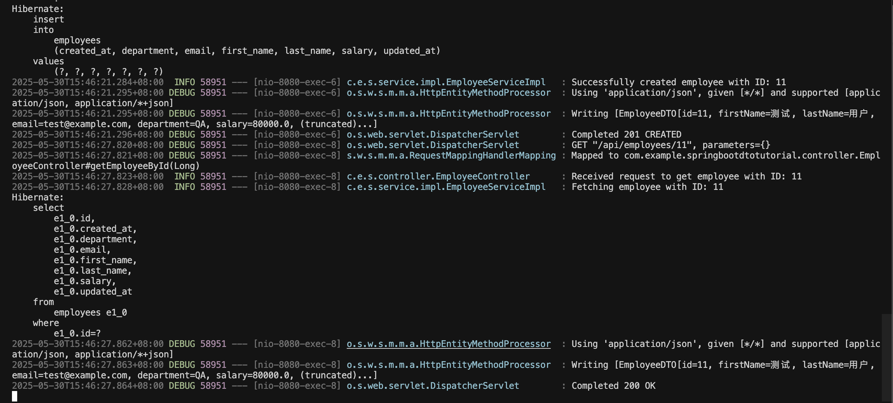

# Spring Boot DTO Tutorial 使用 Java Record

这是一个基于Spring Boot的完整CRUD REST API演示项目，展示了如何使用Java Record作为DTO（Data Transfer Object）的最佳实践。

## 项目概述

本项目演示了以下技术要点：
- 使用Java Record替代传统DTO类
- 实体（Entity）与DTO的分层设计
- 完整的CRUD操作实现
- 全局异常处理
- 数据验证
- RESTful API设计

## 运行效果展示



*项目成功运行截图：展示了MySQL数据库启动、Spring Boot应用启动以及API测试的完整流程*

## 技术栈

- **Java 17+** - 使用Java Record特性
- **Spring Boot 3.2.0** - 主框架
- **Spring Data JPA** - 数据持久化
- **MySQL** - 主数据库（生产环境）
- **H2** - 内存数据库（测试环境）
- **Maven** - 项目构建工具
- **Docker** - 容器化MySQL数据库

## 项目结构

```
src/main/java/com/example/springbootdtotutorial/
├── SpringBootDtoTutorialApplication.java  # 主应用类
├── config/
│   └── DataInitializer.java               # 数据初始化器
├── controller/
│   └── EmployeeController.java            # REST控制器
├── dto/
│   ├── EmployeeDTO.java                   # 主DTO (Java Record)
│   ├── CreateEmployeeRequest.java         # 创建请求DTO
│   └── UpdateEmployeeRequest.java         # 更新请求DTO
├── exception/
│   ├── ResourceNotFoundException.java     # 资源未找到异常
│   ├── DuplicateResourceException.java    # 重复资源异常
│   └── GlobalExceptionHandler.java        # 全局异常处理器
├── model/
│   └── Employee.java                      # 员工实体类
├── repository/
│   └── EmployeeRepository.java            # 数据访问层
└── service/
    ├── EmployeeService.java               # 服务接口
    └── impl/
        └── EmployeeServiceImpl.java       # 服务实现类
```

## 核心技术要点

### 1. Java Record 的优势

```java
// 传统DTO类需要大量样板代码
public class EmployeeDTO {
    private Long id;
    private String firstName;
    // ... 大量getter、setter、constructor、equals、hashCode方法
}

// Java Record 简洁优雅
public record EmployeeDTO(
    Long id,
    String firstName,
    String lastName,
    String email,
    String department,
    Double salary,
    LocalDateTime createdAt,
    LocalDateTime updatedAt
) {
    // 自动生成constructor、getter、toString、equals、hashCode
    // 还可以添加自定义方法
    public String getFullName() {
        return firstName + " " + lastName;
    }
}
```

**Java Record 优势:**
- **不可变性** - 所有字段都是final
- **线程安全** - 不可变对象天然线程安全
- **减少样板代码** - 自动生成常用方法
- **更好的性能** - 编译器优化
- **简洁语法** - 提高代码可读性

### 2. 分层架构设计

```
Controller层 (只处理HTTP) 
    ↓ 接收/返回DTO
Service层 (业务逻辑 + Entity↔DTO转换)
    ↓ 操作Entity
Repository层 (数据访问)
    ↓ 持久化Entity
Database层
```

**关键原则:**
- Controller层只处理DTO，从不接触Entity
- Service层负责Entity与DTO的转换
- Repository层只操作Entity对象
- 数据库敏感信息不会暴露到API层

### 3. Entity与DTO的转换

```java
// Service层的转换方法
private EmployeeDTO convertToDTO(Employee employee) {
    return new EmployeeDTO(
        employee.getId(),
        employee.getFirstName(),
        employee.getLastName(),
        employee.getEmail(),
        employee.getDepartment(),
        employee.getSalary(),
        employee.getCreatedAt(),
        employee.getUpdatedAt()
    );
}

private Employee convertToEntity(CreateEmployeeRequest request) {
    return new Employee(
        request.firstName(),
        request.lastName(),
        request.email(),
        request.department(),
        request.salary()
    );
}
```

## 🛠️ 快速开始

### 方式一：一键启动（推荐） 

**前提条件：**
- Java 17+ 
- Maven 3.6+
- Docker Desktop

**一键启动命令：**
```bash
# 克隆项目后，直接运行启动脚本
./start-project.sh
```

这个脚本会自动：
1. 检查Docker状态
2. 启动MySQL数据库容器
3. 等待数据库就绪
4.  编译Spring Boot项目
5.  启动应用
6.  提供测试选项

**停止项目：**
```bash
./stop-project.sh
```

### 方式二：手动启动

#### 1. 启动MySQL数据库

**使用Docker Compose（推荐）：**
```bash
# 启动MySQL容器
docker-compose up -d mysql

# 检查容器状态
docker ps
```

**或使用Docker命令：**
```bash
docker run -d \
  --name spring-dto-mysql \
  -e MYSQL_ROOT_PASSWORD=rootpassword \
  -e MYSQL_DATABASE=springbootdb \
  -p 3306:3306 \
  mysql:8.0
```

#### 2. 验证数据库连接

```bash
# 测试连接
docker exec -it spring-dto-mysql mysql -u root -p
# 密码：rootpassword

# 在MySQL中验证数据库
mysql> SHOW DATABASES;
mysql> USE springbootdb;
```

#### 3. 运行Spring Boot应用

```bash
# 编译项目
mvn clean compile

# 启动应用
mvn spring-boot:run
```

应用将在 `http://localhost:8080` 启动。

#### 4. 验证应用

```bash
# 健康检查
curl http://localhost:8080/api/employees/health

# 获取所有员工（初始数据）
curl http://localhost:8080/api/employees

# 运行完整API测试
./test-api.sh
```

### 方式三：使用H2内存数据库（快速测试）

如果不想使用Docker，可以切换到H2数据库：

```bash
# 1. 编辑 application.properties，注释MySQL配置，启用H2配置
# 2. 直接启动应用
mvn spring-boot:run
```

**H2数据库配置：**
```properties
# 注释MySQL配置
# spring.datasource.url=jdbc:mysql://localhost:3306/springbootdb...

# 启用H2配置
spring.datasource.url=jdbc:h2:mem:testdb
spring.datasource.driver-class-name=org.h2.Driver
spring.h2.console.enabled=true
```

访问H2控制台：`http://localhost:8080/h2-console`

### Docker配置说明

**docker-compose.yml 关键配置：**
```yaml
services:
  mysql:
    image: registry.openanolis.cn/openanolis/mysql:8.0.30-8.6 #使用国内的镜像源，支持x86_64/ARM64
    environment:
      MYSQL_ROOT_PASSWORD: rootpassword
      MYSQL_DATABASE: springbootdb
    ports:
      - "3306:3306"
    volumes:
      - mysql_data:/var/lib/mysql  # 数据持久化
```

**数据库连接信息：**
- 主机：`localhost`
- 端口：`3306`
- 数据库：`springbootdb`
- 用户名：`root`
- 密码：`rootpassword`

### 故障排除

**常见问题解决：**

1. **端口3306被占用**
```bash
# 查看占用进程
lsof -i :3306
# 停止占用的服务或容器
```

2. **Docker连接问题**
```bash
# 检查Docker状态
docker info
# 重启Docker服务
```

3. **MySQL容器启动失败**
```bash
# 查看容器日志
docker logs spring-dto-mysql
# 重新创建容器
docker-compose down && docker-compose up -d
```

4. **应用无法连接数据库**
```bash
# 检查MySQL是否就绪
docker exec spring-dto-mysql mysqladmin ping -h localhost
# 检查网络连接
telnet localhost 3306
```

## API 接口文档

### 员工管理接口

| 方法 | 端点 | 描述 | 请求体 |
|------|------|------|--------|
| GET | `/api/employees` | 获取所有员工 | - |
| GET | `/api/employees/{id}` | 根据ID获取员工 | - |
| POST | `/api/employees` | 创建新员工 | CreateEmployeeRequest |
| PUT | `/api/employees/{id}` | 更新员工信息 | UpdateEmployeeRequest |
| DELETE | `/api/employees/{id}` | 删除员工 | - |
| GET | `/api/employees/email/{email}` | 根据邮箱获取员工 | - |
| GET | `/api/employees/department/{dept}` | 根据部门获取员工 | - |
| GET | `/api/employees/search?name={name}` | 根据姓名搜索员工 | - |
| GET | `/api/employees/salary?min={min}&max={max}` | 薪水范围查询 | - |
| GET | `/api/employees/check-email?email={email}` | 检查邮箱是否存在 | - |

### 示例请求

**创建员工：**
```bash
curl -X POST http://localhost:8080/api/employees \
  -H "Content-Type: application/json" \
  -d '{
    "firstName": "张",
    "lastName": "三",
    "email": "zhangsan@example.com",
    "department": "IT",
    "salary": 75000
  }'
```

**获取所有员工：**
```bash
curl http://localhost:8080/api/employees
```

**更新员工：**
```bash
curl -X PUT http://localhost:8080/api/employees/1 \
  -H "Content-Type: application/json" \
  -d '{
    "firstName": "张",
    "lastName": "三丰",
    "salary": 85000
  }'
```

## 关键特性展示

### 1. 数据验证

```java
public record CreateEmployeeRequest(
    @NotBlank(message = "First name is required")
    String firstName,
    
    @NotBlank(message = "Last name is required") 
    String lastName,
    
    @Email(message = "Email should be valid")
    String email,
    
    @Positive(message = "Salary must be positive")
    Double salary
) {}
```

### 2. 全局异常处理

```java
@RestControllerAdvice
public class GlobalExceptionHandler {
    
    @ExceptionHandler(ResourceNotFoundException.class)
    public ResponseEntity<ErrorResponse> handleResourceNotFoundException(ResourceNotFoundException ex) {
        // 统一的错误响应格式
    }
    
    @ExceptionHandler(MethodArgumentNotValidException.class) 
    public ResponseEntity<ValidationErrorResponse> handleValidationException(MethodArgumentNotValidException ex) {
        // 验证错误的详细信息
    }
}
```

### 3. 自定义查询方法

```java
@Repository
public interface EmployeeRepository extends JpaRepository<Employee, Long> {
    
    // 根据邮箱查找
    Optional<Employee> findByEmail(String email);
    
    // 根据部门查找
    List<Employee> findByDepartment(String department);
    
    // 自定义JPQL查询
    @Query("SELECT e FROM Employee e WHERE e.salary BETWEEN :minSalary AND :maxSalary")
    List<Employee> findEmployeesBySalaryRange(@Param("minSalary") Double minSalary, @Param("maxSalary") Double maxSalary);
}
```

## 最佳实践

### 1. DTO设计原则
- 使用Java Record实现不可变DTO
- 为不同操作创建专门的DTO（CreateRequest、UpdateRequest）
- 在DTO中添加验证注解
- 可以在Record中添加自定义业务方法

### 2. 分层设计原则
-  Controller只处理HTTP层逻辑，不包含业务逻辑
-  Service层负责业务逻辑和Entity↔DTO转换
- Repository层只操作Entity，不关心DTO
- 异常统一在GlobalExceptionHandler处理

### 3. 安全考虑
-  使用DTO避免暴露敏感Entity字段
- 输入验证防止恶意数据
- 统一异常处理避免信息泄露

## 测试建议

使用Postman、curl或任何REST客户端测试API：

1. **健康检查**: `GET /api/employees/health`
2. **获取所有员工**: `GET /api/employees`
3. **创建员工**: `POST /api/employees`
4. **更新员工**: `PUT /api/employees/{id}`
5. **删除员工**: `DELETE /api/employees/{id}`

### 实际运行结果

项目完全运行成功，主要验证结果：

**数据库连接成功**: 使用OpenAnolis MySQL 8.0.30镜像，支持ARM64架构  
**应用启动正常**: Spring Boot 3.2.0 + Java 23，启动时间约2秒  
**数据初始化完成**: 自动创建10个示例员工数据  
**API响应正常**: 所有CRUD操作测试通过  
**DTO转换正确**: Entity与DTO之间转换无误  
**日志输出清晰**: 可以看到完整的SQL执行和请求处理过程  

**关键功能验证:**
-  **Entity ↔ DTO 转换**: Service层自动处理转换逻辑
- **数据验证**: Java Record的验证注解正常工作
- **自定义方法**: Record中的`getFullName()`等业务方法正确执行
- 数据持久化**: MySQL数据库读写正常，事务处理正确
- RESTful API**: 标准HTTP状态码和响应格式

