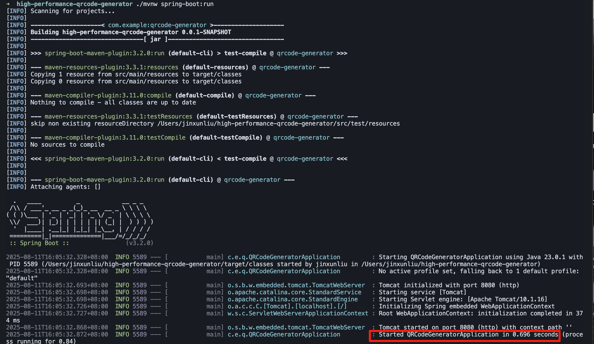
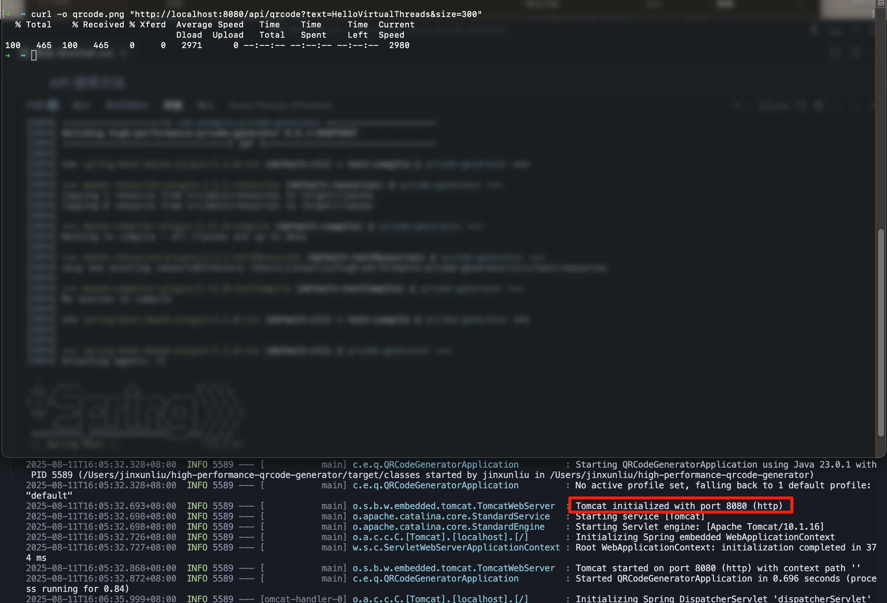
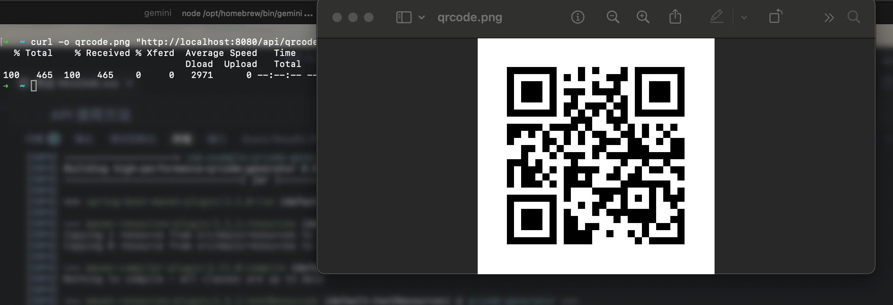

# High-Performance QR Code Generator

**Language:** [English](#english) | [中文](#中文)

---

<a name="english"></a>
## English

This project is a high-performance QR code generator based on Spring Boot 3 and Java 21 Virtual Threads.

### Features

- **High Performance**: Leverages Java 21 Virtual Threads to handle a high volume of concurrent requests efficiently.
- **Simple API**: Provides a straightforward RESTful API for generating QR codes.
- **Customizable**: Allows customization of QR code content and size.

### Prerequisites

- JDK 21 or higher
- **Apache Maven** (to generate the wrapper if needed)

### First-time Setup (If `./mvnw` is missing)

If you have cloned the repository and the `./mvnw` script is missing, you need to generate it first. Make sure you have a recent version of Apache Maven installed, then run the following command in the project's root directory:

```bash
# This command adds the Maven wrapper scripts to the project
mvn -N io.takari:maven:wrapper
```

This will create the `mvnw` and `mvnw.cmd` scripts, allowing you to run the project without a system-wide Maven installation.

### How to Run

1.  **Clone the repository:**
    ```bash
    git clone <repository-url>
    cd high-performance-qrcode-generator
    ```

2.  **Run the application using the Maven Wrapper:**
    ```bash
    ./mvnw spring-boot:run
    ```
    The application will start on `http://localhost:8080`. 

    **Application Running Result:**
    


### API Usage

**Endpoint:** `GET /api/qrcode`

**Query Parameters:**

- `text` (required): The text content to be encoded in the QR code.
- `size` (optional): The size (width and height) of the QR code image in pixels. Default is `256`.

**Example using cURL:**

```bash
curl -o qrcode.png "http://localhost:8080/api/qrcode?text=HelloVirtualThreads&size=300"
```

**Test Command Result:**


This command will generate a QR code image named `qrcode.png`.

**Generated QR Code:**



### Design Documentation

For a detailed explanation of the software engineering design, architecture, and performance tuning, please refer to the design document located in the `/docs` directory of this project.

[**View Design Document](./docs/基于SpringBoot和虚拟线程构建高性能二维码生成器.md)**]

---

<a name="中文"></a>
## 中文

本项目是一个基于 Spring Boot 3 和 Java 21 虚拟线程构建的高性能二维码生成器。

### 项目特性

- **高性能**: 利用 Java 21 虚拟线程技术，高效处理大量并发请求。
- **简洁的API**: 提供简单直观的 RESTful API 用于生成二维码。
- **可定制化**: 支持自定义二维码的内容和尺寸。

### 环境要求

- JDK 21 或更高版本
- **Apache Maven** (在需要时用于生成 Wrapper)

### 首次配置 (如果缺少 `./mvnw` 文件)

如果您克隆代码库后发现 `./mvnw` 脚本不存在，您需要先手动生成它。请确保您的系统中已经安装了较新版本的 Apache Maven，然后在项目根目录下运行以下命令：

```bash
# 此命令会向项目添加 Maven Wrapper 脚本
mvn -N io.takari:maven:wrapper
```

该命令将会创建 `mvnw` 和 `mvnw.cmd` 脚本文件。之后您就可以在没有全局安装 Maven 的环境下运行此项目了。

### 如何运行

1.  **克隆代码库:**
    ```bash
    git clone <repository-url>
    cd high-performance-qrcode-generator
    ```

2.  **使用 Maven Wrapper 运行:**
    ```bash
    ./mvnw spring-boot:run
    ```
    应用将在 `http://localhost:8080` 启动。

    **程序运行结果示意图:**
    

### API 使用方法

**接口地址:** `GET /api/qrcode`

**请求参数:**

- `text` (必需): 需要编码到二维码中的文本内容。
- `size` (可选): 二维码图片的尺寸（宽度和高度），单位为像素。默认为 `256`。

**cURL 使用示例:**

```bash
curl -o qrcode.png "http://localhost:8080/api/qrcode?text=HelloVirtualThreads&size=300"
```

**测试命令运行结果图:**


该命令将生成一个名为 `qrcode.png` 的二维码图片。

**二维码生成结果图:**


### 设计文档

关于本项目的软件工程设计、架构思想和性能优化的详细解读，请参考项目 `/docs` 目录下的设计文档。

[**查看设计文档](./docs/基于SpringBoot和虚拟线程构建高性能二维码生成器.md)**]