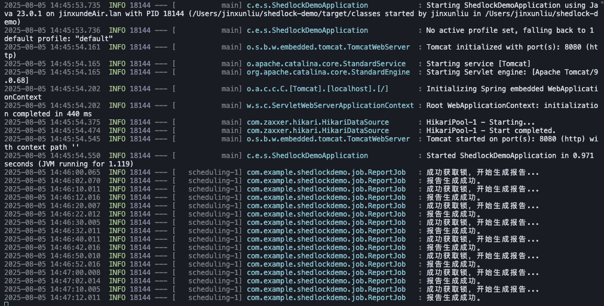

# ShedLock 分布式定时任务演示项目

本项目是一个基于 Spring Boot 和 ShedLock 的简单示例，旨在演示如何在分布式环境中安全、可靠地执行定时任务。

## 项目核心功能

- **Spring Boot 应用**：构建了一个基础的 Web 应用。
- **分布式锁**：集成 ShedLock，并使用 PostgreSQL 作为锁提供者，确保在多实例部署时，同一个定时任务在同一时间只会被一个节点执行。
- **定时任务**：包含一个每 10 秒执行一次的示例任务 (`ReportJob`)，用于模拟生成报告的业务场景。

## 技术栈

- **Java 11**
- **Spring Boot 2.7.5**
- **ShedLock 4.46.0** (使用 `shedlock-provider-jdbc-template`)
- **PostgreSQL** (通过 Docker 运行)
- **Maven**

## 如何运行项目

1.  **启动数据库**：
    确保您的本地 Docker 环境已启动，并运行一个 PostgreSQL 实例。您可以使用以下命令启动一个用于测试的容器：
    ```bash
    docker run --name shedlock-postgres -e POSTGRES_PASSWORD=mysecretpassword -e POSTGRES_USER=postgres -e POSTGRES_DB=postgres -p 5432:5432 -d postgres
    ```

2.  **配置数据库连接**：
    项目已将数据库连接信息配置在 `src/main/resources/application.properties` 文件中。如果您的数据库配置不同，请相应修改此文件。

3.  **运行 Spring Boot 应用**：
    在项目根目录下，执行以下 Maven 命令：
    ```bash
    mvn spring-boot:run
    ```

## 生产环境定时任务技术方案

在生产环境中使用定时任务，需要考虑更多的因素，如**任务的可观测性、错误处理、动态调度和分布式协调**等。`@Scheduled` 注解虽然简单，但在复杂场景下存在诸多局限。

关于如何在生产环境中选择和设计更健壮的定时任务方案，**请务必参考本项目 `docs/` 目录下的详细技术方案文档**：

- [**在生产环境中避免使用Spring@Scheduled**](./docs/在生产环境中避免使用Spring @Scheduled.md)

## 运行结果

项目成功运行后，您将在控制台看到定时任务的日志输出。ShedLock 会确保即使启动多个应用实例，任务日志也只会在一个实例中打印。

**运行结果截图请参考 `images/` 目录下的图片：**


