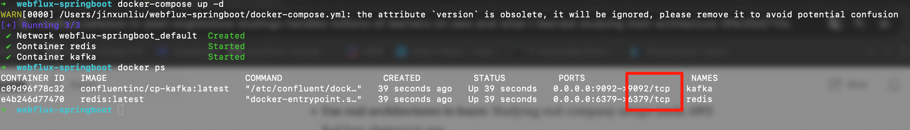
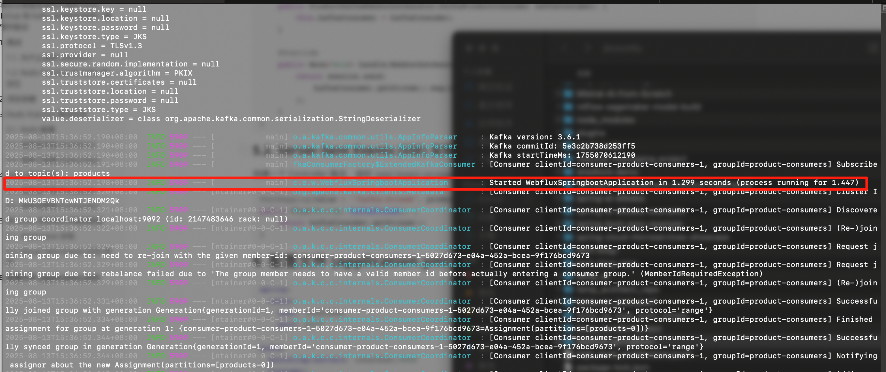
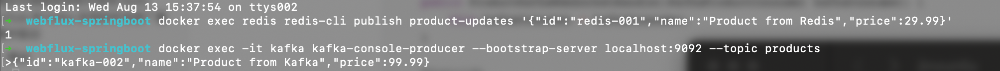
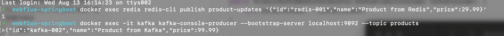
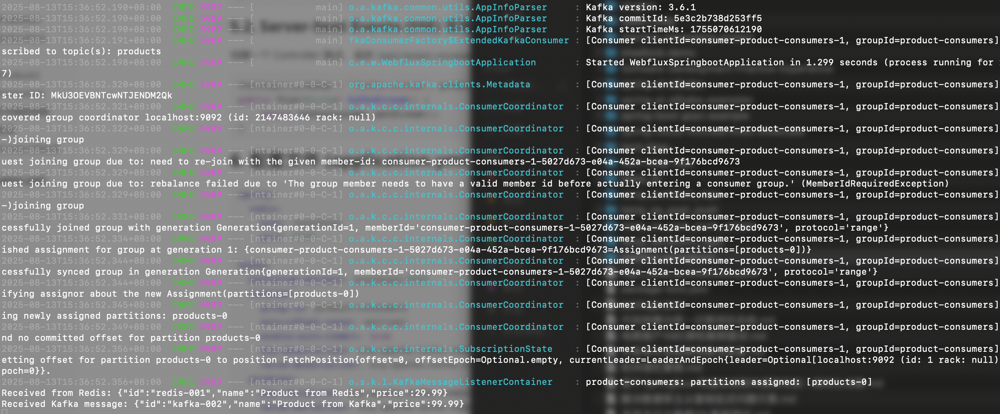
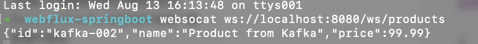
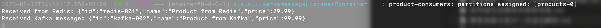

# WebFlux 响应式微服务中的实时消息传递

## 简介

本项目演示了如何在 Spring WebFlux 构建的响应式微服务中，利用 Redis Pub/Sub 和 Kafka 实现实时消息广播和事件驱动的架构。项目代码包含了完整的生产者（Publisher/Producer）、消费者（Subscriber/Consumer）以及通过 WebSocket 和 Server-Sent Events (SSE) 将消息流式传输到前端的实现。

这对于需要高并发、实时性和弹性扩展的现代应用（如实时仪表盘、在线聊天、金融交易更新）是一个核心实践。

## 技术栈

- **框架**: Spring Boot with Spring WebFlux
- **响应式编程**: Project Reactor
- **消息中间件**: Redis Pub/Sub, Apache Kafka
- **实时通信**: WebSocket, Server-Sent Events (SSE)
- **构建工具**: Maven

## 环境准备

- Java 17+
- Maven 3.8+
- Docker 和 Docker Compose (用于快速启动 Redis 和 Kafka)

## 安装与启动

1.  **克隆项目**
    ```bash
    git clone [your-repo-url]
    cd webflux-springboot
    ```

2.  **启动依赖服务 (Redis & Kafka)**
    项目根目录已包含 `docker-compose.yml` 文件，可一键启动所需服务：
    ```bash
    docker-compose up -d
    ```

3.  **运行 Spring Boot 应用**
    ```bash
    mvn spring-boot:run
    ```
    应用启动成功后，即可开始测试。

## 如何测试

请按照以下步骤进行手动端到端测试，建议打开多个终端窗口。

### 步骤 1: 启动所有服务

确保您的 Docker 容器（Redis, Kafka）和 Spring Boot 应用都已成功启动。





### 步骤 2: 选择一种方式监听实时更新

您可以通过 SSE 或 WebSocket 来接收实时消息，任选其一即可。

**选项 A：使用 SSE (通过 `curl`)**

打开一个 **新的终端**，运行以下命令。此连接会保持开放，用于接收服务器事件。

```bash
curl -N http://localhost:8080/sse/products
```

**选项 B：使用 WebSocket (通过 `websocat`)**

如果您没有 `websocat`，请先安装它（例如在 macOS 上 `brew install websocat`）。
打开一个 **新的终端**，运行以下命令以建立持久的 WebSocket 连接。

```bash
websocat ws://localhost:8080/ws/products
```

### 步骤 3: 发布消息进行测试

现在，您可以在另外的终端中向 Redis 或 Kafka 发布消息，并在步骤 2 的监听终端中观察结果。

**通过 Redis 发布:**

在 **新的终端** 中执行：
```bash
docker exec redis redis-cli publish product-updates '{"id":"redis-001","name":"Product from Redis","price":29.99}'
```
发布后，您应该能在监听终端（`curl` 或 `websocat`）中看到对应的 JSON 输出。

**通过 Kafka 发布:**

在 **新的终端** 中执行，进入交互式生产者模式：
```bash
docker exec -it kafka kafka-console-producer --bootstrap-server localhost:9092 --topic products
```
然后输入以下 JSON 并按回车：
```json
{"id":"kafka-002","name":"Product from Kafka","price":99.99}
```




您会立刻在监听终端中看到这条新消息。







## 生产环境代码健壮性说明

请注意，本项目的当前实现主要出于**教学和演示目的**，旨在清晰地展示**响应式编程、消息队列集成和实时通信的核心概念**。

为了在生产环境中稳健运行，还需要考虑更多因素。本项目已在**源代码的注释**中，为各个关键组件提供了详细的健壮性设计建议和生产级代码的最佳实践。这包括但不限于：

-   **更完善的错误处理**：例如在响应式流中加入 `onError` 处理逻辑。
-   **异步结果确认**：例如处理 Kafka 生产者的 `CompletableFuture` 返回值。
-   **精细的背压策略**：避免因消费者性能不足导致内存溢出。
-   **连接保持机制**：为 SSE 和 WebSocket 添加心跳以防止代理超时。
-   **幂等性设计**：确保消息在重试时不会被重复处理。
